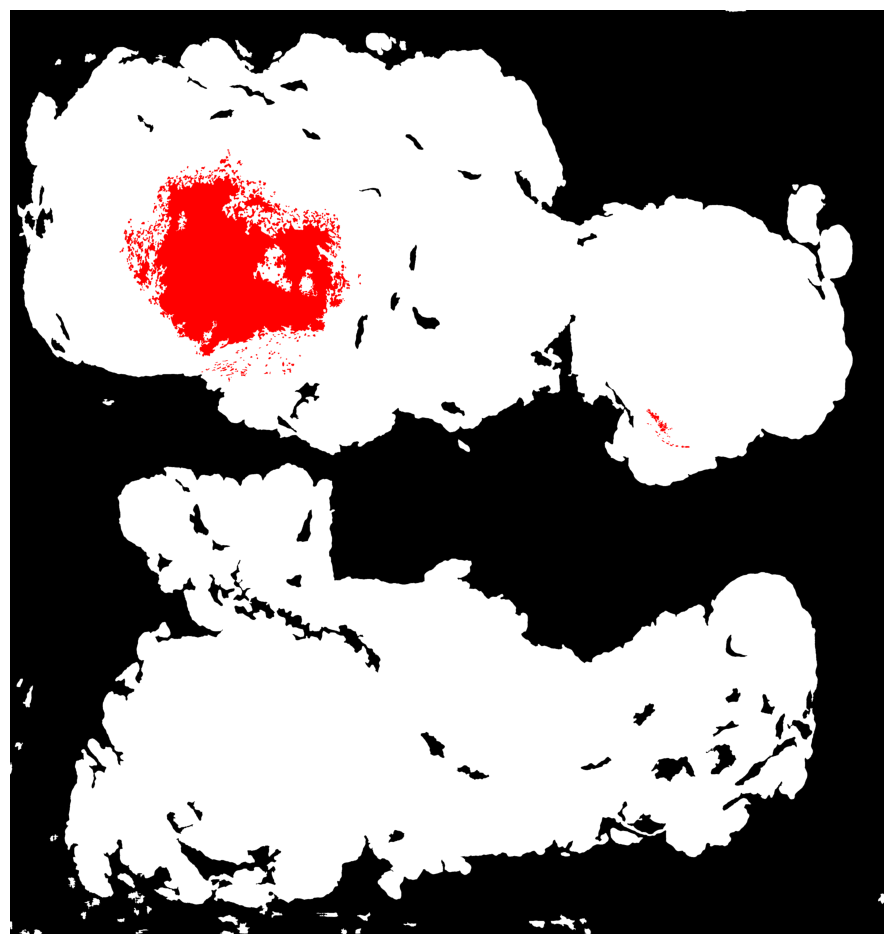

  

<!-- TABLE OF CONTENTS -->

  
Table of Contents

  <ol>
    <li>
      <a href="#about-the-project">About The Project</a>
      </ul>
    </li>
    <li><a href="#license">License</a></li>
    <li><a href="#contact">Contact</a></li>
    <li><a href="#acknowledgments">Acknowledgments</a></li>
  </ol>

<!-- GETTING STARTED -->
## About the project

This repository is the result of work for the Machine Learning Project course at TUB (Winter Semester 2024/25). The goal of the project was to replicate the results of the ["TransMIL: Transformer based Correlated Multiple Instance Learning for Whole Slide Image Classification"](https://arxiv.org/abs/2106.00908), a study that leverages the use of the transformers and Multiple Instance Learning methods to enhance the classification on high-resolution input data slides, which are independently divided into smaller patches. MIL is a widely used approach in weakly supervised learning and very suitable approach to deal with the challenges of the [CAMELYON16](https://camelyon16.grand-challenge.org/Data/) dataset, which was used for the task.

It is worth noting that the preprocessing of the Whole Slide Images (dividing them into smaller patches, discarding the slide's background and extracting features with a pretrained neural net) was not a part of the project. Input features have been provided by the project's coordinator and obtained via [CTransPath paper](https://www.semanticscholar.org/paper/Transformer-based-unsupervised-contrastive-learning-WangYang/439e78726a9c4a30216ebc43a82e44758a5a4619) - more data specific feature extraction method than the one used in the original paper (pretrained network on ImageNet).

In the end the original results not only have been matched, but also outperformed as shown in the table below. This is most likely due to the use of "better" input features.

## Test Results Comparison
The final selected model outperforms the model provided by the authors of the TransMIL paper.

| Name                     | Recall (%) | AUC (%)  | Acc (%)  | Specificity (%) |
|--------------------------|-----------|---------|---------|----------------|
| 512_no_ppeg_larger_lr   | 89.8  | **95.00** | **91.47** | 92.50          |
| TransMIL paper model    | n/a       | 93.09   | 88.37   | n/a            |

## xAI
To further analyze the model’s performance, 3 different xAI methods have been implemented - Attention Rollout, Salient Gradients, Integrated Gradients. They were utilized to generate the per-patch importance scores, which allowed for the generation of visual heatmaps presenting where the model focuses its attention in the classification process. Besides the heatmap, a quantitative summary of the model’s decision process has also been obtained.

Method that was best able to differentiate between the cancer and non-cancer regions on patch-level was Attention Rollout -> highest AUROC score.

  

<!-- USAGE EXAMPLES -->

Due to the use of very specific features, which are not shared publicly, the training results will not be reproducible. Features have been extracted with the method described in the [CTransPath paper](https://www.semanticscholar.org/paper/Transformer-based-unsupervised-contrastive-learning-WangYang/439e78726a9c4a30216ebc43a82e44758a5a4619).
In any case for usage examples, please refer to the [usage guide](docs/usage.md)

(<a href="#readme-top">back to top</a>)

<!-- LICENSE -->
## License
Distributed under the MIT License. See `LICENSE.txt` for more information.

(<a href="#readme-top">back to top</a>)

<!-- CONTACT -->
## Contact
* Filip Matysik - f.matysik@campus.tu-berlin.de

(<a href="#readme-top">back to top</a>)

<!-- ACKNOWLEDGMENTS -->
## Acknowledgments

Helpful libraries and papers used in the project

* [WandB](https://wandb.ai/site)
* [TransMIL: Transformer based Correlated Multiple Instance Learning for Whole Slide Image Classification](https://arxiv.org/abs/2106.00908)
* [Camelyon Dataset](https://camelyon16.grand-challenge.org/Data/)
* [CTransPath for feature extraction](https://www.semanticscholar.org/paper/Transformer-based-unsupervised-contrastive-learning-WangYang/439e78726a9c4a30216ebc43a82e44758a5a4619)

(<a href="#readme-top">back to top</a>)

