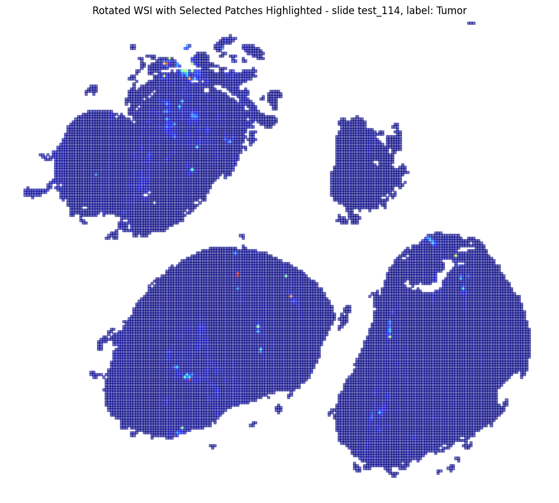
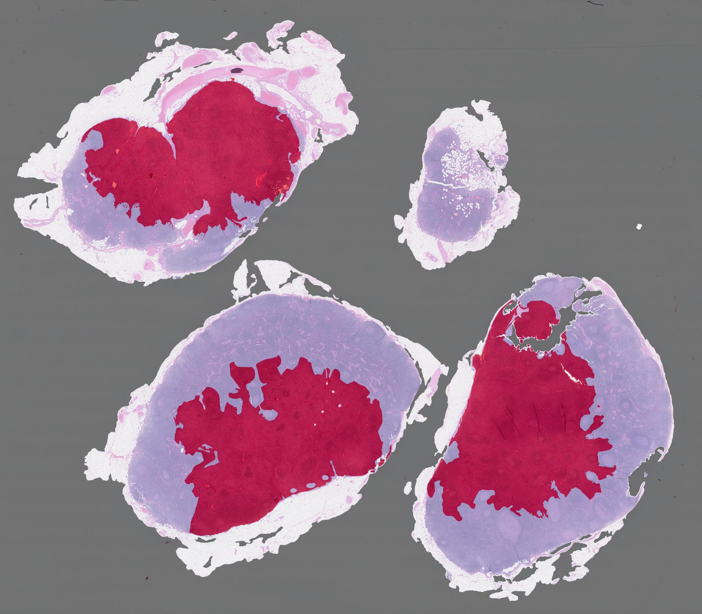

  
  

**To run the training please run the below command in the /home/pml16/ folder**

sample_training:
apptainer run --nv -B /home/space/datasets/camelyon16:/mnt ./captum_container.sif python MS3/train.py --split /home/pml16/camelyon16_mini_split.csv --run_name mini_run_1

full training:
apptainer run --nv -B /home/space/datasets/camelyon16:/mnt ./captum_container.sif python MS3/train.py --split /mnt/splits/camelyon16_tumor_85_15_orig_0.csv --config MS3/CamelyonConfig/config.yaml --run_name full_train_1

where:
- **-B** mounts the directory with the dataset to the container, so that it can be accesed by apptainer from the inside. It is important to mount this exact directory: /home/space/datasets/camelyon16:/mnt
- **--split** is the absolute path to the chosen split version of the CAMELYON16 dataset. It can be omitted, then the default split is chosen: 'camelyon16_tumor_85_15_orig_0.csv'
- **--config** is the absolute path to the chosen comfiguration of the model and run file, in the .yaml format. It can be omitted, then the default split is chosen: 'config.yaml'
- **--run_name** name of the current experiment, which will be saved to wandb

**To run the heatmap visualization please run the below command in the /home/pml16/ folder**

heatmap visualization:
apptainer run --nv -B /home/space/datasets/camelyon16:/mnt ./captum_container.sif python MS3/visualize_heatmap.py --split /mnt/splits/camelyon16_tumor_85_15_orig_0.csv --config MS3/CamelyonConfig/config.yaml --case_id test_027 --method att_rollout --save_dir /home/pml16/

where:
- **-B** mounts the directory with the dataset to the container, so that it can be accesed by apptainer from the inside. It is important to mount this exact directory: /home/space/datasets/camelyon16:/mnt
- **--split** is the absolute path to the chosen split version of the CAMELYON16 dataset. It can be omitted, then the default split is chosen: 'camelyon16_tumor_85_15_orig_0.csv'
- **--config** is the absolute path to the chosen comfiguration of the model and run file, in the .yaml format. It can be omitted, then the default split is chosen: 'config.yaml'
- **--case_id** is the id of the test case for which the heatmap will be generated. It can be omitted, then the default sample is: 'test_001'
- **--method** is the absolute path to the chosen explainability method, based on which the heatmap will be visualized. It can be omitted, then the default method is: 'att_rollout'. Other options are: "integrated_grads" and "saliency_grads"
- **--save_dir** is the directory where the heatmap will be saved (it can't). It can be omitted, then the default sample is: 'test_001'
